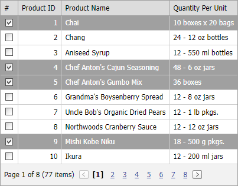

<!-- default badges list -->

[](https://supportcenter.devexpress.com/ticket/details/E20039)
[](https://docs.devexpress.com/GeneralInformation/403183)
<!-- default badges end -->

# Grid View for ASP.NET MVC - How to select row when a page is opened for the first time 
This example demonstrates how to specify a list of rows in a Controller, pass this data to a View, and select the specified rows when a page is opened for the first time.



We use the `ViewBag` dictionary to transfer row keys from Controller to View.

**HomeController.cs**
```cs
ViewData["selectedRows"] = new int[] { 1, 5, 9, 4, 11, 17, 34, 77 };
```

In the View, we call the [SelectRowByKey](https://docs.devexpress.com/AspNet/DevExpress.Web.Data.GridViewSelection.SelectRowByKey(System.Object)) method in the [PreRender](https://docs.devexpress.com/AspNetMvc/DevExpress.Web.Mvc.SettingsBase.PreRender) event to select the specified rows.

**GridView.cshtml**
```cs
settings.PreRender = (sender, e) => {
    MVCxGridView gridView = sender as MVCxGridView;
        if ((gridView != null) && (ViewData["selectedRows"] != null)) {
            int[] selectedRows = (int[])ViewData["selectedRows"];
            foreach (int key in selectedRows) {
            gridView.Selection.SelectRowByKey(key);
        }
    }
};
```

## Files to Review

* [HomeController.cs](./CS/DevExpressMvcApplication1/Controllers/HomeController.cs) (VB: [HomeController.vb](./VB/DevExpressMvcApplication1/Controllers/HomeController.vb))
* [GridView.cshtml](./CS/DevExpressMvcApplication1/Views/Home/GridView.cshtml)
